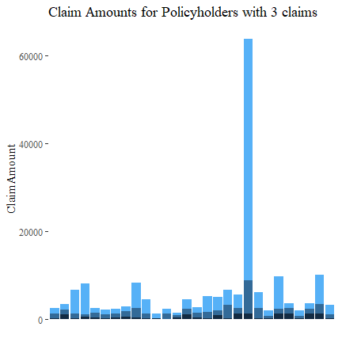
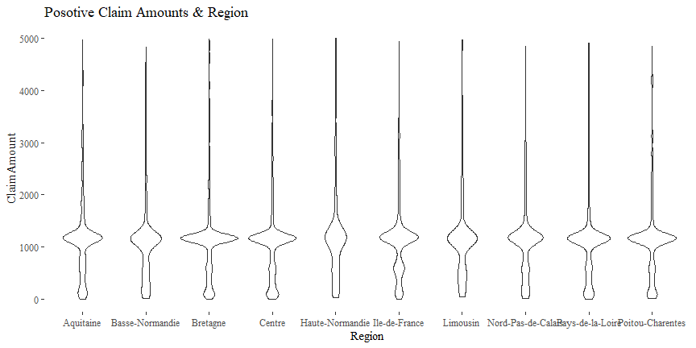

# Real Data: Preliminary Analyais

**Author**: [Spark Tseung](https://sparktseung.com)

**Last Modified**: Sept 15, 2020

Introduction
------------

In this document, we will perform some preliminary analysis and data
cleaning of the French Motor Third-Party Liability dataset
(`freMTPLfreq` and `freMTPLsev` in the `CASdatasets` package). The
dataset can be loaded using the following code.

    library(CASdatasets)
    data(freMTPLfreq, freMTPLsev)

Data Cleaning
-------------

The `freMTPLfreq` contains a number of policy features (covariates) and
the number of claims filed by each policy.

    head(freMTPLfreq)

    ##   PolicyID ClaimNb Exposure Power CarAge DriverAge
    ## 1        1       0     0.09     g      0        46
    ## 2        2       0     0.84     g      0        46
    ## 3        3       0     0.52     f      2        38
    ## 4        4       0     0.45     f      2        38
    ## 5        5       0     0.15     g      0        41
    ## 6        6       0     0.75     g      0        41
    ##                                Brand     Gas             Region Density
    ## 1 Japanese (except Nissan) or Korean  Diesel          Aquitaine      76
    ## 2 Japanese (except Nissan) or Korean  Diesel          Aquitaine      76
    ## 3 Japanese (except Nissan) or Korean Regular Nord-Pas-de-Calais    3003
    ## 4 Japanese (except Nissan) or Korean Regular Nord-Pas-de-Calais    3003
    ## 5 Japanese (except Nissan) or Korean  Diesel   Pays-de-la-Loire      60
    ## 6 Japanese (except Nissan) or Korean  Diesel   Pays-de-la-Loire      60

    summary(freMTPLfreq)

    ##     PolicyID         ClaimNb           Exposure            Power      
    ##  1      :     1   Min.   :0.00000   Min.   :0.002732   f      :95718  
    ##  2      :     1   1st Qu.:0.00000   1st Qu.:0.200000   g      :91198  
    ##  3      :     1   Median :0.00000   Median :0.540000   e      :77022  
    ##  4      :     1   Mean   :0.03916   Mean   :0.561088   d      :68014  
    ##  5      :     1   3rd Qu.:0.00000   3rd Qu.:1.000000   h      :26698  
    ##  6      :     1   Max.   :4.00000   Max.   :1.990000   j      :18038  
    ##  (Other):413163                                        (Other):36481  
    ##      CarAge          DriverAge                                    Brand       
    ##  Min.   :  0.000   Min.   :18.00   Fiat                              : 16723  
    ##  1st Qu.:  3.000   1st Qu.:34.00   Japanese (except Nissan) or Korean: 79060  
    ##  Median :  7.000   Median :44.00   Mercedes, Chrysler or BMW         : 19280  
    ##  Mean   :  7.532   Mean   :45.32   Opel, General Motors or Ford      : 37402  
    ##  3rd Qu.: 12.000   3rd Qu.:54.00   other                             :  9866  
    ##  Max.   :100.000   Max.   :99.00   Renault, Nissan or Citroen        :218200  
    ##                                    Volkswagen, Audi, Skoda or Seat   : 32638  
    ##       Gas                        Region          Density     
    ##  Diesel :205945   Centre            :160601   Min.   :    2  
    ##  Regular:207224   Ile-de-France     : 69791   1st Qu.:   67  
    ##                   Bretagne          : 42122   Median :  287  
    ##                   Pays-de-la-Loire  : 38751   Mean   : 1985  
    ##                   Aquitaine         : 31329   3rd Qu.: 1410  
    ##                   Nord-Pas-de-Calais: 27285   Max.   :27000  
    ##                   (Other)           : 43290

### Claim Number

The response `ClaimNb` is significantly zero-inflated, and very few
policyholders have more than one claim.

    summary(freMTPLfreq$ClaimNb)

    ##    Min. 1st Qu.  Median    Mean 3rd Qu.    Max. 
    ## 0.00000 0.00000 0.00000 0.03916 0.00000 4.00000

    table(freMTPLfreq$ClaimNb)

    ## 
    ##      0      1      2      3      4 
    ## 397779  14633    726     28      3

Let’s see which policyholders have 4 claims and their claim amounts.
There doesn’t seem to be any discernible pattern.

    # Which policies have 4 claims?
    four.idx = which(freMTPLfreq$ClaimNb==4)
    # freMTPLfreq[four.idx,]
    # What are the claim amounts?
    four.id = freMTPLfreq[four.idx,1]
    df4 = freMTPLsev[freMTPLsev[,1] %in% four.id,]
    df4

    ##       PolicyID ClaimAmount
    ## 322     311457        1011
    ## 323     311457        1221
    ## 329     311457        2267
    ## 330     311457        1189
    ## 1713    226856         196
    ## 1714    226856        3411
    ## 1715    226856         201
    ## 1716    226856         570
    ## 13086    18652         417
    ## 13118    18652        1155
    ## 13124    18652        2129
    ## 13254    18652        1110

Similarly, let’s look at policyholders with 3 claims. There is no
discernible pattern.

Now those with 2 claims.

There are some policyholder with extremely large claims. Let’s remove
the highest 10 and then plot again. There is no discernible pattern.

We will not separately plot policyholders with only one claim (see also
the next subsection on Claim Amount).

### Claim Amount

The `freMTPLsev` contains the `PolicyID` and `ClaimAmount` for those who
have filed claims. Some summary statistics and a histogram are shown
below. It is multi-modal, over-dispersed, right-skewed and heavy-tailed.

    # Summary Staitistics
    summary(freMTPLsev$ClaimAmount)

    ##    Min. 1st Qu.  Median    Mean 3rd Qu.    Max. 
    ##       2     698    1156    2130    1243 2036833

    mean(freMTPLsev$ClaimAmount)

    ## [1] 2129.972

    sd(freMTPLsev$ClaimAmount)

    ## [1] 21063.64

    skewness(freMTPLsev$ClaimAmount)

    ## [1] 75.13135

    kurtosis(freMTPLsev$ClaimAmount)

    ## [1] 6601.197

Clearly, there are some very large outliers of `ClaimAmount`. We will
ignore some of these data points.

    # Some Quantiles
    quantile(freMTPLsev$ClaimAmount, c(0.90, 0.95, 0.99, 0.995, 0.9975, 0.999, 0.9999))

    ##       90%       95%       99%     99.5%    99.75%     99.9%    99.99% 
    ##   2583.00   4284.00  16109.40  35431.50  68302.65 131834.02 725143.52

    # Beyond 2 SD away from mean
    mean(freMTPLsev$ClaimAmount) + 2*sd(freMTPLsev$ClaimAmount)

    ## [1] 44257.26

    # Extremely large claims
    freMTPLsev$ClaimAmount[freMTPLsev$ClaimAmount>70000]

    ##  [1]   73417   85294  125705   86331  114936   96906   85804   72479  116379
    ## [10]  301302  137003   72960  132502  254944  120931  152135 2036833  306559
    ## [19]  128791  115412   92031  205090  240884 1402330  186612  281403   71253
    ## [28]  182568   86466  115511  209462  182467  181697   75060   89598  210837

    # We will delete claim amounts > 100000
    sev.cutoff = 100000

### Exposure

The variable `Exposure` in `freMTPLfreq` contains the exposure (i.e. how
long the policy covers). Most are one-year or less, with a few policies
longer than that but less than two years.

    # Summary Staitistics
    summary(freMTPLfreq$Exposure)

    ##     Min.  1st Qu.   Median     Mean  3rd Qu.     Max. 
    ## 0.002732 0.200000 0.540000 0.561088 1.000000 1.990000

One may expect that, the longer the policy exposure, the more likely
that a claim will be made (all others held constant). However, the
following plot does not support this, as those with 3 or 4 claims can
also have a quite short exposure. Meanwhile, a number of policies with
zero claim tend to have shorter exposures.

We will also exclude policies with `Exposure > 1` from our analysis.

    exposure.cutoff = 1
    # Exposure deleted
    freMTPLfreq$Exposure[freMTPLfreq$Exposure>exposure.cutoff]

    ##   [1] 1.99 1.50 1.53 1.48 1.09 1.01 1.01 1.34 1.46 1.34 1.07 1.04 1.08 1.01 1.07
    ##  [16] 1.01 1.06 1.02 1.08 1.01 1.12 1.15 1.13 1.05 1.01 1.08 1.01 1.07 1.15 1.02
    ##  [31] 1.01 1.01 1.03 1.16 1.02 1.08 1.03 1.02 1.15 1.03 1.01 1.01 1.02 1.01 1.02
    ##  [46] 1.02 1.01 1.22 1.04 1.01 1.03 1.01 1.01 1.04 1.13 1.02 1.01 1.04 1.23 1.01
    ##  [61] 1.01 1.16 1.01 1.01 1.02 1.01 1.01 1.02 1.09 1.04 1.04 1.01 1.01 1.41 1.03
    ##  [76] 1.03 1.01 1.02 1.01 1.02 1.03 1.05 1.01 1.02 1.01 1.11 1.01 1.01 1.02 1.01
    ##  [91] 1.23 1.05 1.01 1.09 1.01 1.02 1.11 1.09 1.23 1.02 1.01 1.34 1.38 1.08 1.14
    ## [106] 1.23 1.01 1.25 1.02 1.07 1.05 1.03 1.09 1.43 1.04 1.02 1.02 1.02 1.02 1.01
    ## [121] 1.01 1.02 1.25 1.02 1.09 1.12 1.08 1.01 1.01 1.04 1.01 1.01 1.14 1.03 1.23
    ## [136] 1.41 1.09 1.01 1.07 1.03 1.01 1.01 1.02 1.05 1.06 1.03 1.06 1.07 1.03 1.03
    ## [151] 1.02 1.01 1.11 1.01 1.01 1.01 1.03 1.20 1.01 1.06 1.03 1.10 1.26 1.02 1.01
    ## [166] 1.04 1.01 1.03 1.01 1.02 1.21 1.04 1.03 1.01 1.01 1.04 1.02 1.03 1.03 1.05
    ## [181] 1.03 1.10 1.01 1.02 1.15 1.01 1.01 1.01 1.03 1.07 1.18 1.02 1.01 1.02 1.24
    ## [196] 1.03 1.36 1.03 1.02 1.03 1.06 1.02 1.01 1.20 1.48 1.01 1.01 1.01 1.03 1.04
    ## [211] 1.10 1.36 1.02 1.01 1.01 1.01 1.01 1.06 1.13 1.01 1.07 1.02 1.01 1.18 1.07
    ## [226] 1.04 1.03 1.34 1.01 1.43 1.13 1.02 1.03 1.65 1.03 1.02 1.13 1.98 1.04 1.11
    ## [241] 1.03 1.07 1.19 1.17 1.24 1.06 1.12 1.18 1.12 1.02 1.01 1.08 1.18 1.07 1.27
    ## [256] 1.25 1.11 1.03 1.11 1.06 1.18 1.04 1.01 1.07 1.56 1.06 1.01 1.03 1.03 1.17
    ## [271] 1.06 1.24 1.19 1.03 1.23 1.10 1.03 1.03 1.08 1.17 1.03 1.11 1.12 1.04 1.07
    ## [286] 1.03 1.05 1.05 1.02 1.05 1.01 1.28 1.01 1.01 1.09 1.32 1.22 1.43 1.17 1.12
    ## [301] 1.33 1.01 1.30 1.52 1.35 1.22 1.03 1.12 1.05 1.04 1.01 1.35 1.16 1.01 1.05
    ## [316] 1.01 1.30 1.90 1.41 1.46 1.50 1.12 1.19 1.05 1.03 1.75 1.39 1.27 1.90 1.70
    ## [331] 1.27 1.49 1.64 1.48 1.48 1.07 1.07 1.01 1.14 1.07 1.24 1.15 1.11 1.03 1.01
    ## [346] 1.02 1.01 1.01 1.03 1.04 1.15 1.15 1.02 1.01 1.23 1.18 1.15 1.10 1.06 1.07
    ## [361] 1.13 1.09 1.06 1.06 1.03 1.04 1.19 1.05 1.11 1.10 1.01 1.01 1.14 1.18 1.03
    ## [376] 1.02 1.03 1.19 1.10 1.01 1.03 1.16 1.03 1.02 1.01 1.01 1.02 1.07 1.02 1.04
    ## [391] 1.01 1.03 1.01 1.02 1.01 1.01 1.01 1.01 1.07 1.08 1.06 1.16 1.03 1.01 1.02
    ## [406] 1.03 1.03 1.03 1.04 1.03 1.03 1.01 1.04 1.01 1.13 1.11 1.08 1.09 1.01 1.18
    ## [421] 1.01

    # Data to ignore due to Exposure > 1: 421 entries.
    didx.exposure = (freMTPLfreq$Exposure>1)
    summary(didx.exposure)

    ##    Mode   FALSE    TRUE 
    ## logical  412748     421

### Power

`Power` is a categorical variable describing the power of a car. There
is not any data issue. The majority of policies have car power of type
`d` to `j`. A simple chi-squared test on contingency table also suggests
that `Power` and `ClaimNb` are **not** independent: power types `e`,
`f`, `m` and `n` tend to have more claims.

    summary(freMTPLfreq$Power)

    ##     d     e     f     g     h     i     j     k     l     m     n     o 
    ## 68014 77022 95718 91198 26698 17616 18038  9537  4681  1832  1307  1508

    PNbtable = table(freMTPLfreq$Power, freMTPLfreq$ClaimNb)
    PNbtable

    ##    
    ##         0     1     2     3     4
    ##   d 65791  2098   116     7     2
    ##   e 73988  2875   152     6     1
    ##   f 91905  3633   176     4     0
    ##   g 87887  3163   143     5     0
    ##   h 25748   902    46     2     0
    ##   i 16924   665    24     3     0
    ##   j 17364   638    36     0     0
    ##   k  9174   347    15     1     0
    ##   l  4527   146     8     0     0
    ##   m  1759    70     3     0     0
    ##   n  1255    48     4     0     0
    ##   o  1457    48     3     0     0

    chisq = chisq.test(PNbtable)
    chisq

    ## 
    ##  Pearson's Chi-squared test
    ## 
    ## data:  PNbtable
    ## X-squared = 100.35, df = 44, p-value = 2.737e-06

    # Probability of making a claim
    1-t(round(sweep(PNbtable, 1, rowSums(PNbtable), FUN = "/"),4)[,1])

    ##           d      e      f      g      h      i      j      k      l      m
    ## [1,] 0.0327 0.0394 0.0398 0.0363 0.0356 0.0393 0.0374 0.0381 0.0329 0.0398
    ##           n      o
    ## [1,] 0.0398 0.0338

### Car Age

For `CarAge`, the extremely large values seem quite suspicious.

    # Check the large values in CarAge
    freMTPLfreq$CarAge[freMTPLfreq$CarAge>90]

    ##  [1] 100 100  99  99  99  99  99  99  99  99  99  99  99  99  99  99  99  99  99
    ## [20]  99  99  99  99 100 100 100 100 100 100 100 100 100 100 100 100 100 100 100
    ## [39] 100 100 100 100 100

Based on the data summary and histogram plot, it is reasonable to assume
(without further information available) that `99` and `100` are used for
either missing or error data entries. There are also some extremely old
cars. We will ignore all these data points when conducting further
analysis.

    # Some Quantiles
    quantile(freMTPLfreq$CarAge, c(0.90, 0.95, 0.99, 0.995, 0.9975, 0.999, 0.9999))

    ##    90%    95%    99%  99.5% 99.75%  99.9% 99.99% 
    ##     15     17     22     25     29     34     99

    # Beyond 2 SD away from mean
    mean(freMTPLfreq$CarAge) + 2*sd(freMTPLfreq$CarAge)

    ## [1] 19.05843

    # We will delete CarAge > 30
    carage.cutoff = 30

    # Data to ignore due to invalid CarAge: 846 entries.
    didx.carage = (freMTPLfreq$CarAge>carage.cutoff)
    summary(didx.carage)

    ##    Mode   FALSE    TRUE 
    ## logical  412323     846

### Driver Age

For `DriverAge`, we take a similar approach as in `CarAge`.

    # Large values
    freMTPLfreq$DriverAge[freMTPLfreq$DriverAge>90]

    ##   [1] 95 93 91 99 91 99 99 95 91 99 95 99 99 99 99 99 99 99 99 99 99 99 99 99 99
    ##  [26] 99 99 99 99 99 99 99 99 99 99 91 94 99 99 95 93 93 99 99 99 99 93 93 99 99
    ##  [51] 99 99 99 99 99 92 92 91 91 93 92 91 99 92 99 99 99 99 99 91 99 92 99 99 99
    ##  [76] 99 93 94 94 95 99 99 99 99 99 95 99 96 91 91 91 91 91 91 91 92 92 96 91 92
    ## [101] 95 95 94 91 91 94 94 94 92 93 93 93 92 91 91 91 91 92 91 91 91 91 91 94 95
    ## [126] 95 96 96 97 92 92 92 92 92 92 91 91 93 91 97 92 93 96 92 91 95 95 91 91 95
    ## [151] 95 92 93 93 94 91 94 91 91 94 94 91 91 91 92 91 92 91 92 93 92 91 92 91 96
    ## [176] 97 97 91 98 93 93 93 93 91 93 91 91 92 94 91 93 94 97 91 91 93 92 96 92 96
    ## [201] 96 96 91 93 93 94 93 93 94 95 92 95 91 92 92 92 92 92 93 92 93 94 93 92 92
    ## [226] 97 92 91 99 94 94 91 94 92 94 91 92 91 91 91 92 93 91 91 91 95 91 92 94 91
    ## [251] 98 92 92 91 92 91 94 93 97 93 97 97 91 91 92 91 91 91 91 91 91 91 95 91 91
    ## [276] 91 91 91 94 94 95 95 91 96 93 96 91 92 93 93 93 91 91 91 91 91 93 94 94 95
    ## [301] 91 91 93 93 98 91 93

Based on the data summary and histogram plot, it is reasonable to assume
(without further information available) that `99` is used for either
missing or error data entries, or just any age larger than or equal to
`99`. We will also ignore these data points when conducting further
analysis.

    # Data to ignore due to ambiguous DriverAge: 59 entries.
    didx.driverage = (freMTPLfreq$DriverAge==99)
    summary(didx.driverage)

    ##    Mode   FALSE    TRUE 
    ## logical  413110      59

### Brand

`Brand` is also a categorical variable, and there is no invalid data
point. The analysis is similar to `Power`. `Brand` is also not
independent of `ClaimNb`: It appears that `General Motors or Ford`,
`Volkswagen, Audi, Skoda or Seat` and `Mercedes, Chrysler or BMW Opel`
are riskier than other brands.

    summary(freMTPLfreq$Brand)

    ##                               Fiat Japanese (except Nissan) or Korean 
    ##                              16723                              79060 
    ##          Mercedes, Chrysler or BMW       Opel, General Motors or Ford 
    ##                              19280                              37402 
    ##                              other         Renault, Nissan or Citroen 
    ##                               9866                             218200 
    ##    Volkswagen, Audi, Skoda or Seat 
    ##                              32638

    BNbtable = table(freMTPLfreq$Brand, freMTPLfreq$ClaimNb)
    BNbtable

    ##                                     
    ##                                           0      1      2      3      4
    ##   Fiat                                16043    648     30      2      0
    ##   Japanese (except Nissan) or Korean  77150   1748    157      4      1
    ##   Mercedes, Chrysler or BMW           18481    767     30      2      0
    ##   Opel, General Motors or Ford        35746   1584     70      1      1
    ##   other                                9473    375     16      2      0
    ##   Renault, Nissan or Citroen         209649   8173    365     13      0
    ##   Volkswagen, Audi, Skoda or Seat     31237   1338     58      4      1

    chisq = chisq.test(BNbtable)
    chisq

    ## 
    ##  Pearson's Chi-squared test
    ## 
    ## data:  BNbtable
    ## X-squared = 553.76, df = 24, p-value < 2.2e-16

    # Probability of making a claim
    1-t(round(sweep(BNbtable, 1, rowSums(BNbtable), FUN = "/"),4)[,1])

    ##        Fiat Japanese (except Nissan) or Korean Mercedes, Chrysler or BMW
    ## [1,] 0.0407                             0.0242                    0.0414
    ##      Opel, General Motors or Ford  other Renault, Nissan or Citroen
    ## [1,]                       0.0443 0.0398                     0.0392
    ##      Volkswagen, Audi, Skoda or Seat
    ## [1,]                          0.0429

### Gas

`Gas` is a categorical with only two levels: `Regular` and `Diesel`. All
data entries are valid. There are roughly the same number of cars for
each gas type, but `Diesel` cars tend to have a higher probability of
claims.

    summary(freMTPLfreq$Gas)

    ##  Diesel Regular 
    ##  205945  207224

    GNbtable = table(freMTPLfreq$Gas, freMTPLfreq$ClaimNb)
    GNbtable

    ##          
    ##                0      1      2      3      4
    ##   Diesel  197904   7655    369     15      2
    ##   Regular 199875   6978    357     13      1

    chisq = chisq.test(GNbtable)
    chisq

    ## 
    ##  Pearson's Chi-squared test
    ## 
    ## data:  GNbtable
    ## X-squared = 37.804, df = 4, p-value = 1.23e-07

    # Probability of making a claim
    1-t(round(sweep(GNbtable, 1, rowSums(GNbtable), FUN = "/"),4)[,1])

    ##      Diesel Regular
    ## [1,]  0.039  0.0355

### Region

There are a number of regions where the policies are issued. All data
entries are valid. Regions with a higher probability of claims are
`Bretagne`,`Limousin` and `Poitou-Charentes`.

    summary(freMTPLfreq$Region)

    ##          Aquitaine    Basse-Normandie           Bretagne             Centre 
    ##              31329              10893              42122             160601 
    ##    Haute-Normandie      Ile-de-France           Limousin Nord-Pas-de-Calais 
    ##               8784              69791               4567              27285 
    ##   Pays-de-la-Loire   Poitou-Charentes 
    ##              38751              19046

    RNbtable = table(freMTPLfreq$Region, freMTPLfreq$ClaimNb)
    RNbtable

    ##                     
    ##                           0      1      2      3      4
    ##   Aquitaine           30344    919     62      4      0
    ##   Basse-Normandie     10464    406     23      0      0
    ##   Bretagne            40329   1718     72      3      0
    ##   Centre             154339   6053    206      2      1
    ##   Haute-Normandie      8575    198     11      0      0
    ##   Ile-de-France       67398   2205    179      8      1
    ##   Limousin             4383    172     11      1      0
    ##   Nord-Pas-de-Calais  26413    806     61      4      1
    ##   Pays-de-la-Loire    37253   1422     74      2      0
    ##   Poitou-Charentes    18281    734     27      4      0

    chisq = chisq.test(RNbtable)
    chisq

    ## 
    ##  Pearson's Chi-squared test
    ## 
    ## data:  RNbtable
    ## X-squared = 285.13, df = 36, p-value < 2.2e-16

    # Probability of making a claim
    1-t(round(sweep(RNbtable, 1, rowSums(RNbtable), FUN = "/"),4)[,1])

    ##      Aquitaine Basse-Normandie Bretagne Centre Haute-Normandie Ile-de-France
    ## [1,]    0.0314          0.0394   0.0426  0.039          0.0238        0.0343
    ##      Limousin Nord-Pas-de-Calais Pays-de-la-Loire Poitou-Charentes
    ## [1,]   0.0403              0.032           0.0387           0.0402

### Density

The variable `Density` for population density is continuous. There is no
invalid data point. Also, it seems that `Density` has a finer resolution
than `Region`.

    # Summary Staitistics
    summary(freMTPLfreq$Density)

    ##    Min. 1st Qu.  Median    Mean 3rd Qu.    Max. 
    ##       2      67     287    1985    1410   27000

One may expect that, the higher the population density, the more likely
that a claim will be made (all others held constant). This is somewhat
illustrated by the following violin plot.

Based on the previous analysis, we only need to delete invalid data or
outliers based on `Exposure`, `CarAge` and `DriverAge`. In total, there
are 1324 data points deleted. Data cleaning based for `ClaimAmount` is
deferred to the next section.

Preliminary Analysis of Claim Amount
------------------------------------

Our primary interest is the response variable `ClaimAmount`. We first
merge the dataframes `freMTPLfreq` and `freMTPLsev`, and then analyze
the relationship between `ClaimAmount` and the policy covariates.

    # Merge two dataframes
    df = merge(x = freMTPLfreq, y = freMTPLsev, all = TRUE)
    # Zero claim amount is matched to NA: replace them by zero
    df$ClaimAmount[is.na(df$ClaimAmount)] = 0
    summary(df)

    ##     PolicyID         ClaimNb           Exposure            Power      
    ##  18652  :     4   Min.   :0.00000   Min.   :0.002732   f      :95902  
    ##  226856 :     4   1st Qu.:0.00000   1st Qu.:0.200000   g      :91351  
    ##  311457 :     4   Median :0.00000   Median :0.540000   e      :77189  
    ##  15608  :     3   Mean   :0.04309   Mean   :0.561368   d      :68150  
    ##  25363  :     3   3rd Qu.:0.00000   3rd Qu.:1.000000   h      :26748  
    ##  25580  :     3   Max.   :4.00000   Max.   :1.990000   j      :18074  
    ##  (Other):413939                                        (Other):36546  
    ##      CarAge          DriverAge                                    Brand       
    ##  Min.   :  0.000   Min.   :18.00   Fiat                              : 16757  
    ##  1st Qu.:  3.000   1st Qu.:34.00   Japanese (except Nissan) or Korean: 79228  
    ##  Median :  7.000   Median :44.00   Mercedes, Chrysler or BMW         : 19314  
    ##  Mean   :  7.531   Mean   :45.32   Opel, General Motors or Ford      : 37477  
    ##  3rd Qu.: 12.000   3rd Qu.:54.00   other                             :  9886  
    ##  Max.   :100.000   Max.   :99.00   Renault, Nissan or Citroen        :218591  
    ##                                    Volkswagen, Audi, Skoda or Seat   : 32707  
    ##       Gas                        Region          Density     
    ##  Diesel :206350   Centre            :160814   Min.   :    2  
    ##  Regular:207610   Ile-de-France     : 69989   1st Qu.:   67  
    ##                   Bretagne          : 42200   Median :  287  
    ##                   Pays-de-la-Loire  : 38829   Mean   : 1987  
    ##                   Aquitaine         : 31399   3rd Qu.: 1410  
    ##                   Nord-Pas-de-Calais: 27357   Max.   :27000  
    ##                   (Other)           : 43372                  
    ##   ClaimAmount       
    ##  Min.   :      0.0  
    ##  1st Qu.:      0.0  
    ##  Median :      0.0  
    ##  Mean   :     83.3  
    ##  3rd Qu.:      0.0  
    ##  Max.   :2036833.0  
    ## 

    nrow(df)

    ## [1] 413960

    # Also delete large claims
    # lc.idx = (df$ClaimAmount>sev.cutoff)
    # lc.policy = as.integer(df$PolicyID[lc.idx])

    # Delete invalid data
    # df = df[!(df$PolicyID %in% union(del.policy,lc.policy)),]
    df = df[!((df$CarAge > carage.cutoff) | (df$DriverAge > 98) | 
              (df$Exposure > exposure.cutoff) | (df$ClaimAmount > sev.cutoff)),]

    # Check the merge is correct
    summary(df)

    ##     PolicyID         ClaimNb           Exposure            Power      
    ##  18652  :     4   Min.   :0.00000   Min.   :0.002732   f      :95688  
    ##  226856 :     4   1st Qu.:0.00000   1st Qu.:0.200000   g      :91057  
    ##  311457 :     4   Median :0.00000   Median :0.530000   e      :77016  
    ##  15608  :     3   Mean   :0.04307   Mean   :0.560563   d      :67942  
    ##  25363  :     3   3rd Qu.:0.00000   3rd Qu.:1.000000   h      :26665  
    ##  25580  :     3   Max.   :4.00000   Max.   :1.000000   j      :18029  
    ##  (Other):412588                                        (Other):36212  
    ##      CarAge         DriverAge                                   Brand       
    ##  Min.   : 0.000   Min.   :18.0   Fiat                              : 16716  
    ##  1st Qu.: 3.000   1st Qu.:34.0   Japanese (except Nissan) or Korean: 79199  
    ##  Median : 7.000   Median :44.0   Mercedes, Chrysler or BMW         : 19231  
    ##  Mean   : 7.464   Mean   :45.3   Opel, General Motors or Ford      : 37398  
    ##  3rd Qu.:12.000   3rd Qu.:54.0   other                             :  9815  
    ##  Max.   :30.000   Max.   :98.0   Renault, Nissan or Citroen        :217709  
    ##                                  Volkswagen, Audi, Skoda or Seat   : 32541  
    ##       Gas                        Region          Density     
    ##  Diesel :205918   Centre            :160208   Min.   :    2  
    ##  Regular:206691   Ile-de-France     : 69825   1st Qu.:   67  
    ##                   Bretagne          : 42094   Median :  287  
    ##                   Pays-de-la-Loire  : 38710   Mean   : 1987  
    ##                   Aquitaine         : 31310   3rd Qu.: 1410  
    ##                   Nord-Pas-de-Calais: 27212   Max.   :27000  
    ##                   (Other)           : 43250                  
    ##   ClaimAmount      
    ##  Min.   :    0.00  
    ##  1st Qu.:    0.00  
    ##  Median :    0.00  
    ##  Mean   :   65.38  
    ##  3rd Qu.:    0.00  
    ##  Max.   :96906.00  
    ## 

    nrow(df)

    ## [1] 412609

The summary and marginal histogram of `ClaimAmount` is given as follows.

    summary(df$ClaimAmount)

    ##     Min.  1st Qu.   Median     Mean  3rd Qu.     Max. 
    ##     0.00     0.00     0.00    65.38     0.00 96906.00

### Claim Amount & Exposure

There is not really a discernible pattern of `ClaimAmount` plotted
against `Exposure`. Other than some outliers, the distributions of
`ClaimAmount` given different values `Exposure` seem quite similar.

    cor(df$Exposure, df$ClaimAmount)

    ## [1] 0.01651165

### Claim Amount & Power

There might be some relationship between `ClaimAmount` and `Power`.

### Claim Amount & Car Age

There might be some relationship between `ClaimAmount` and `CarAge`.

    cor(df$CarAge, df$ClaimAmount)

    ## [1] -0.002292825

### Claim Amount & Driver Age

There might be some relationship between `ClaimAmount` and `DriverAge`.

    cor(df$DriverAge, df$ClaimAmount)

    ## [1] -0.002324578

### Claim Amount & Brand

There might be some relationship between `ClaimAmount` and `Brand`.

### Claim Amount & Gas

The relationship between `ClaimAmount` and `Gas` is not quite clear.

### Claim Amount & Region

There might be some relationship between `ClaimAmount` and `Region`.

### Claim Amount & Density

There might be some relationship between `ClaimAmount` and `Density`.

    cor(df$Density, df$ClaimAmount)

    ## [1] -0.0009410736

Saving Data
-----------

We will save the cleaned datasets for further analysis.

    save(df, file = "freMTPLClean.Rda")
